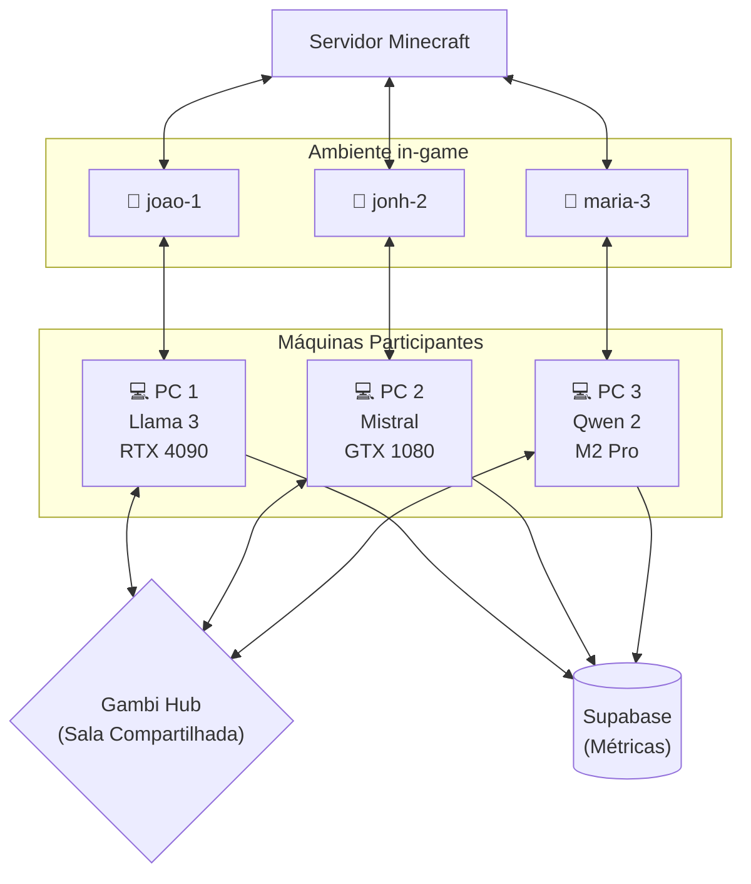

# 🤖 Minecraft Bot — Agente Autônomo (via Gambi)

Bot autônomo de Minecraft controlado por LLM. Cada participante roda sua própria instância do bot com sua própria LLM, e todos jogam no mesmo servidor. Métricas são coletadas no Supabase para análise comparativa de modelos e hardware.

## Como Funciona



Cada bot a cada ciclo (~3s):

1. **Percebe** o mundo (vida, fome, entidades, blocos, inventário)
2. **Monta o prompt** (system + contexto + memória)
3. **Envia** para sua LLM (1 participante, 1 resposta)
4. **Parseia** a resposta (JSON + validação Zod)
5. **Executa** a ação no Minecraft
6. **Loga** métricas no Supabase

## Pré-requisitos

* **Bun** (runtime)
* **Servidor Minecraft** Java Edition (Paper MC recomendado)
* **Gambi Hub** rodando
* **Supabase** (opcional, para coleta de dados)

## Setup

### 1. Hub Gambi + Participantes

```bash
# Terminal 1 — iniciar o hub
gambi hub serve --port 3000 --mdns

# Terminal 2 — criar sala
gambi room create --name "Experimento 1"
# → Room code: ABC123

# Cada pessoa entra na sala com sua LLM:
# PC1
gambi participant join --room ABC123 --participant-id joao-1 --model llama3

# PC2
gambi participant join --room ABC123 --participant-id jonh-2 --model mistral --endpoint http://localhost:1234

# PC3
gambi participant join --room ABC123 --participant-id maria-3 --model qwen2

```
> Link do gambi: https://www.gambi.sh/guides/quickstart/

O `gambi participant join` compartilha automaticamente as specs da máquina (CPU, RAM, GPU). O `participant-id` informado será utilizado automaticamente como o nome do seu bot dentro do servidor de Minecraft.

### 2. Supabase (para coleta de dados)

```bash
# Crie um projeto em supabase.com
# No SQL Editor, execute o conteúdo de supabase/schema.sql
# Copie a URL e a anon key

```

### 3. Configure e execute

```bash
# Em CADA máquina participante:
cp .env.example .env
# Edite .env com SUPABASE_URL e SUPABASE_ANON_KEY

bun install
bun run dev -- --room ABC123

```

O bot auto-detecta qual participante usar (o que tá rodando na mesma máquina via `gambi join`) e entra no jogo com esse nome. Se tiver ambiguidade, especifique:

```bash
bun run dev -- --room ABC123 --participant meu-pc

```

## CLI

```
bun run dev -- --room <ROOM_CODE> [opções]

Opções:
  --room, -r <code>          Código da sala Gambi (obrigatório)
  --participant, -p <name>   Nickname ou ID do participante (opcional — auto-detecta)
  --hub <url>                URL do hub (default: http://localhost:3000)
  --help, -h                 Mostra ajuda

```

## Configuração

| Origem | Variável / Flag | Descrição | Default |
| --- | --- | --- | --- |
| CLI | `--room` | Código da sala | (obrigatório) |
| CLI | `--participant` | ID do participante (define o nome do bot) | (auto-detecta) |
| CLI | `--hub` | URL do hub | `http://localhost:3000` |
| .env | `SUPABASE_URL` | URL do Supabase | (desativado) |
| .env | `SUPABASE_ANON_KEY` | Chave anônima | (desativado) |
| .env | `MINECRAFT_HOST` | Host do servidor | `localhost` |
| .env | `MINECRAFT_PORT` | Porta do servidor | `25565` |

## Banco de Dados (Supabase)

### 3 tabelas

| Tabela | Descrição |
| --- | --- |
| `sessions` | Metadados de cada sessão (sala, bot, participante, duração) |
| `participant_snapshots` | Specs de hardware da máquina (CPU, RAM, GPU, VRAM, OS) |
| `cycle_responses` | Uma linha por ciclo — latência, ação, resultado, prompt, contexto |

### Views de análise

| View | Descrição |
| --- | --- |
| `v_latency_by_setup` | Latência média/p50/p95 por modelo × GPU |
| `v_fastest_per_cycle` | Qual setup teve menor latência em cada ciclo |

## Arquitetura

```
src/
├── index.ts                  # Bootstrap, resolve participante, inicia loop
├── config/
│   └── settings.ts           # Configurações (Gambi + Minecraft + agente)
├── bot/                      # Camada Minecraft (Mineflayer)
│   ├── ActionExecutor.ts     # Executa ações (FALAR, ANDAR, SEGUIR, etc.)
│   ├── BotManager.ts         # Conexão e eventos do bot
│   ├── MovementManager.ts    # Controle de movimento
│   └── PerceptionManager.ts  # Percepção do ambiente
├── core/                     # Lógica principal
│   ├── AgentLoop.ts          # Loop: percepção → LLM → parse → executa → log
│   ├── MemoryManager.ts      # Memória de curto prazo (ring buffer)
│   └── DataLogger.ts         # Envia métricas para Supabase
├── llm/
│   └── GambiarraLLM.ts       # Cliente LLM — invoke() para 1 participante
├── prompts/
│   └── botPrompts.ts         # System prompt + template
├── schemas/
│   └── botAction.ts          # Schema Zod das ações
├── types/
│   ├── types.ts              # Interfaces TypeScript
│   └── gambi-sdk.d.ts        # Tipos do SDK Gambi
└── utils/
    ├── args.ts               # Parser CLI
    ├── fuzzyAction.ts        # Normalização fuzzy de ações do LLM
    ├── jsonParser.ts          # Parse + reparo de JSON
    └── sleep.ts

```

## Ações Disponíveis

| Ação | Descrição |
| --- | --- |
| `FALAR` | Envia mensagem no chat |
| `ANDAR` | Move em uma direção |
| `EXPLORAR` | Movimento aleatório |
| `PULAR` | Faz o bot pular |
| `OLHAR` | Olha para jogadores próximos |
| `PARAR` | Para qualquer movimento |
| `SEGUIR` | Segue um jogador |
| `FUGIR` | Corre de uma entidade |
| `COLETAR` | Minera/coleta bloco próximo |
| `ATACAR` | Ataca entidade próxima |
| `NADA` | Apenas observa |

## Saída do Terminal

```
🤖 Minecraft Bot — Agente Autônomo

   Sala: ABC123
   Hub:  http://localhost:3000

🔍 Auto-detectado: joao-1 (llama3)
✅ Participante: joao-1 — llama3 (GPU: NVIDIA RTX 4090, RAM: 32GB)

🧠 Agente ativado — Conectando no Minecraft como [joao-1]
📊 Session ID: a1b2c3d4-...

━━━ Ciclo #1 ━━━
✅ EXPLORAR (842ms)
💭 Estou num lugar novo, vou explorar para encontrar recursos

━━━ Ciclo #2 ━━━
✅ COLETAR (765ms)
💭 Vi madeira próxima, vou coletar para craftar ferramentas

```
